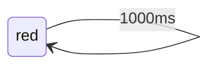
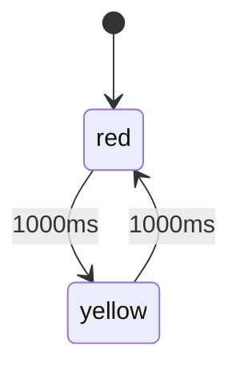

# Overview

In choreography a state is called stance and there are number of ways to transition between them. We also have the control mechanism which is an instance of Choreography (the controller). This provides the method of running the state machine: `dance` and in addition several methods of initialise state transitions:
- `quickstep(nextStance)`: this makes the next call to `dance()` run `nextStance()` instead of the current stance
- `passodoble(setupFunction, nextStance)`: this calles the `setupFunction()` once before reverting to the same state transition mechanism as `quickstep()`
There are two transition methods that are automatically involved when the time in the stance has become equal or greater to the time specified. The timebase can be eiter microseconds or milliseconds as determined when instantiating the controller. Both these methods have the same name but differ in their parameters:
- `sequence(intervall, nextStance)`: if the time spent in the current stance exceeds the intervall atransition to next state will be made just as in `quickstep`
- `sequence(intervall, setupFunction, nextStance)`: This is the analog of `passodoble`, calling the setup function before intiating the transition.
We also have a function that returns the time spent in the stance since the last transition:
- `timeInStance()`: this returns a unsigned long indicating the number of time units spent in the stance (milliseconds or microseconds)
The most central method of Choreography is:
- `controller.dance()`: it will call the current stance function once and thus must be called regularly. As fast as possible to ensure good response, thus the need for non-blocking code in the entire codebase using Choreography

# Blink one
This is a very basic example of how to use the Choreography library. It works the same way as the `Blink without delay` example but the level of abstraction is a bit higher making it easier to generalise. In state machine terminolgy we have:
- a stance state: `blink()`. The only code executed in this state is to check the time spent in this state and transition when this exceeds 1000ms
- a timed transition with setup functionality: `ledDancer.sequence(intervall, setupFunction, newStance)`. For the sake of cimplicity this transition leads to itself updating the timestamp in the process

This is illustrated by this state diagram:

# Blink two a and b

These two examples explore the functionalty of Choreography in different ways. They share the same state diagram:

## Blink two a
`blink_two_a`: makes use of the very basic functionality of Choreography:
- `quickstep(newStance)`: changes the acrive state by the next run of controller.dance
- `timeInStance()`: returns the number of time units since entering the stance

### Code structure

#### Preamble
- lines 1 - 2: include files for arduino and Choreography
- line 4: forward declaration of Choreography stances
- line 5: instantiation of Choreography object: `colorblink`
- line 7: declaring consecutive pin numbers with enum

#### Functions
- lines 9 - 12: arduino `setup()` function
- lines 14 - 16: arduino `loop()` function
- lines 18 - 22: Choreography `stance red()`
- lines 24 - 28: Choreography `stance yellow()`

### Performance

When compiled to an Arduino Nano:
- RAM: 0.8% (used 17 bytes from 2048 bytes)
- Flash: 3.5% (used 1078 bytes from 30720 bytes)

## Blink two b

`blink_two_b`: uses one of the more advanced facilities of Chreography:
- `sequence(intervall, setupFunction, newStance)`
It also makes use of the setup functionality in order to separate program flow and input/output manipulation. This often results in cleaner, more readable code. 

### Code structure

#### Preamble
- lines 1 - 2: include files for arduino and Choreography
- line 4: forward declaration of Choreography stances
- line 5: instantiation of Choreography object: `colorblink`
- line 7: declaring consecutive pin numbers with enum

#### Functions
- Helper functions for display:
    - lines 9 - 12: `stance showRed()`
    - lines 14 - 17: `stace showYellow`
- Arduino functions:
    - lines 20 - 32: `setup()`
    - lines 25 - 27: `loop()`
- State stances:
    - lines 29 - 31: `stance red()`
    - lines 33 - 35: `stance yellow()`

### Performance

When complied to an Arduino Nano:
- RAM: 0.8% (used 17 bytes from 2048 bytes)
- Flash: 3.5% (used 1078 bytes from 30720 bytes)
Thus there is no penalty by using greater abstraction
