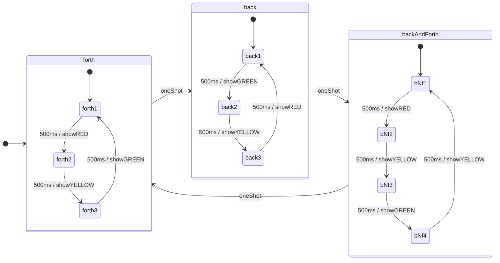
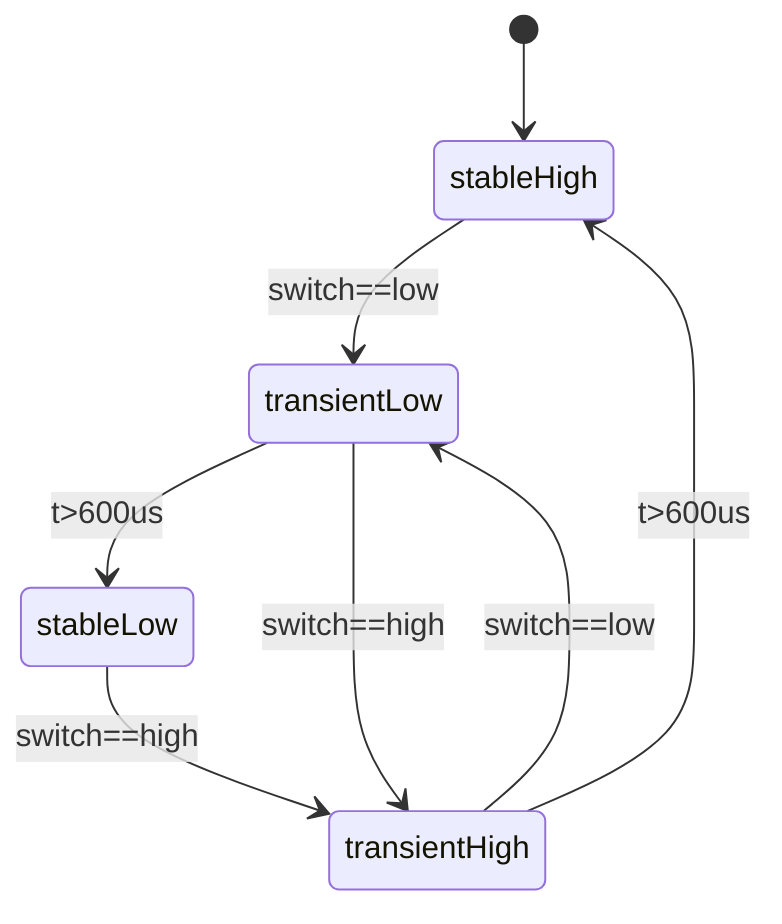

# Example: Hierarchical State machine

In this example we are showing how Choreography can be used to implement hierarchical state machines. We have a main state machine with 3 states: forth, back, backAndForth. Each of the main states shows a diffrent pattern of blinking leds. Each of these patterns is a state machine of its own. The following diagram explains this:

The trasitions between the main states are controlled by a user pushbutton switch which has its own state machine for debouncing. The debounce state machine communicates its actions via a boolean variable named oneShot, which is high exactly 1 arduino-loop cycle when pressed by the user. The state diagram is as following

