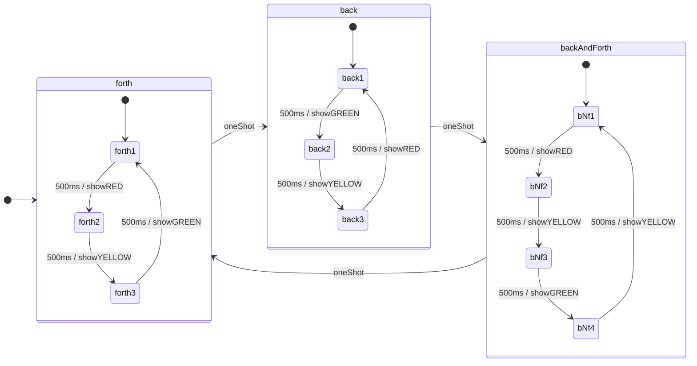
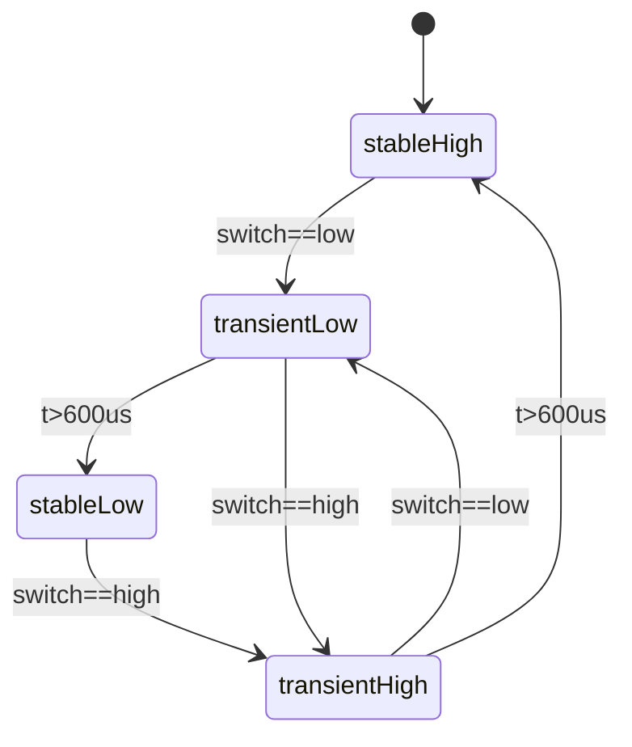

# Example: Hierarchical State machine

In this example we are showing how Choreography can be used to implement hierarchical state machines. We have a main state machine with 3 states: forth, back, backAndForth. Each of the main states shows a diffrent pattern of blinking leds. Each of these patterns is a state machine of its own. The following diagram explains this:

The trasitions between the main states are controlled by a user pushbutton switch which has its own state machine for debouncing. The debounce state machine communicates its actions via a boolean variable named oneShot, which is high exactly 1 arduino-loop cycle when pressed by the user. The time constant 600us is chosen to exceed one single bounce. The state diagram is as following

## Code description

### Preamble

- lines 1-2: includes for Arduino and Choreography

### Enums

- lines 4-5: assign values to physical properties

### Forward declarations

- lines 8 - 10: main machine
- lines 12 - 14: forward sub machine
- lines 16 - 18: backward sub machine
- lines 20 - 22: back and forth sub machine
- lines 24 . 26: debounce machine

 ### Utilities

 - lines 28 - 45: Display functions
    - lines 29 - 33: show red led only
    - lines 35 - 39: show yellow led only
    - lines 41 - 45: show green led only
- line 47: boolean oneShot variable for signalling

### Arduino framework functions

- lines 49 - 55: setup, setting pin directions
- lines 57 - 60: loop, running main machine and debounce machine

### State machine stance implementations

- lines 62 - 83: debounce machine
    - lines 63 - 66: stableLow
    - lines 68 - 71: transient high
    - lines 73 - 77: stable high
    - lines 79 - 83: transient high
- lines 85 - 99: main machine
    - lines 86 - 89: forth
    - lines 91 - 94: back
    - lines 96 - 99: backAndForth
- lines 101 - 111: sub machine stances
    - lines 102 - 104: forth sub machine
    - lines 105 - 107: back sub machine
    - lines 108 - 111: back and forth sub machine

